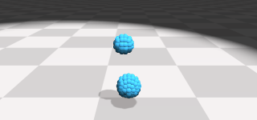
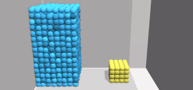
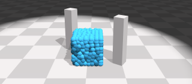

# Learning Particle Dynamics for Manipulating Rigid Bodies, Deformable Objects, and Fluids

Yunzhu Li, Jiajun Wu, Russ Tedrake, Joshua B. Tenenbaum, Antonio Torralba 

**ICLR 2019**
[[website]](http://dpi.csail.mit.edu/) [[paper]](https://arxiv.org/abs/1810.01566) [[video]](https://www.youtube.com/watch?v=Y1kEAL7H-OQ)

## Demo

### Simulation

Rollout from our learned model

  

  

## Installation

This codebase is tested with Ubuntu 16.04 LTS, Python 3.6.8, PyTorch 1.0.0, and CUDA 9.0. Other versions might work but are not guaranteed.

### Install PyFleX

Add and compile PyFleX submodule

    git submodule update --init --recursive
    export PYFLEXROOT=${PWD}/PyFleX
    export PYTHONPATH=${PYFLEXROOT}/bindings/build:$PYTHONPATH
    export LD_LIBRARY_PATH=${PYFLEXROOT}/external/SDL2-2.0.4/lib/x64:$LD_LIBRARY_PATH
    cd PyFleX/bindings; mkdir build; cd build; cmake ..; make -j

Test PyFleX examples

    cd ${PYFLEXROOT}/bindings/examples
    python test_FluidFall.py

## Evaluation

Go to the root folder of `DPI-Net`. You can direct run the following command to use the pretrained checkpoint.

    bash scripts/eval_FluidFall.sh
    bash scripts/eval_BoxBath.sh
    bash scripts/eval_FluidShake.sh
    bash scripts/eval_RiceGrip.sh

It will first show the grount truth followed by the model rollout. The resulting rollouts will be stored in `dump_[env]/eval_[env]/rollout_*`, where the ground truth is stored in `gt_*.tga` and the rollout from the model is `pred_*.tga`.

## Training

You can use the following command to train from scratch. **Note that if you are running the script for the first time**, it will start by generating training and validation data in parallel using `num_workers` threads. You will need to change `--gen_data` to `0` if the data has already been generated.

    bash scripts/train_FluidFall.sh
    bash scripts/train_BoxBath.sh
    bash scripts/train_FluidShake.sh
    bash scripts/train_RiceGrip.sh

## Citing DPI-Net

If you find this codebase useful in your research, please consider citing:

    @inproceedings{li2019learning,
        Title={Learning Particle Dynamics for Manipulating Rigid Bodies, Deformable Objects, and Fluids},
        Author={Li, Yunzhu and Wu, Jiajun and Tedrake, Russ and Tenenbaum, Joshua B and Torralba, Antonio},
        Booktitle = {ICLR},
        Year = {2019}
    }

